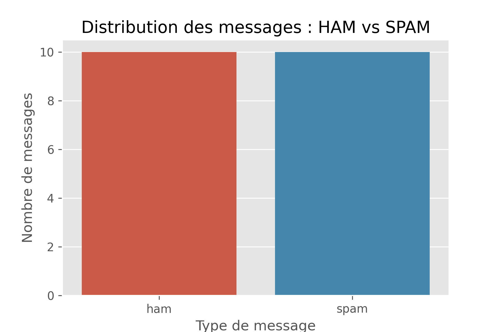
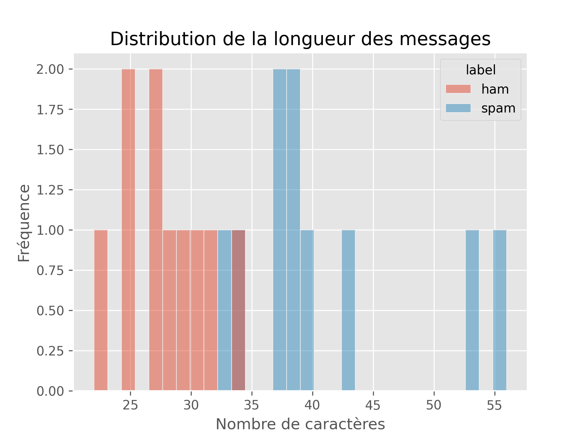
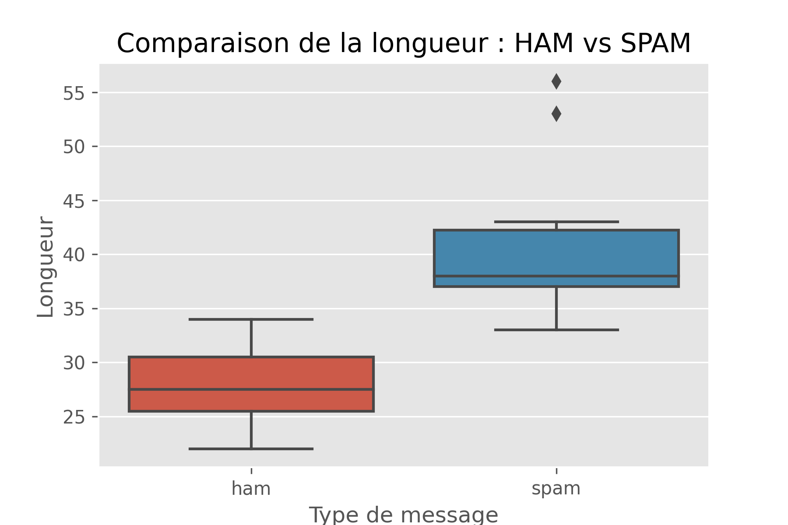
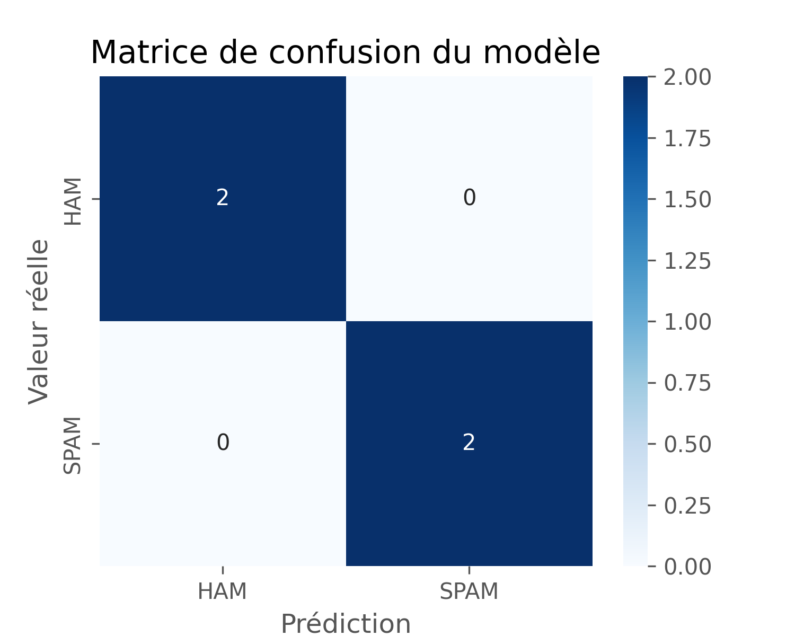
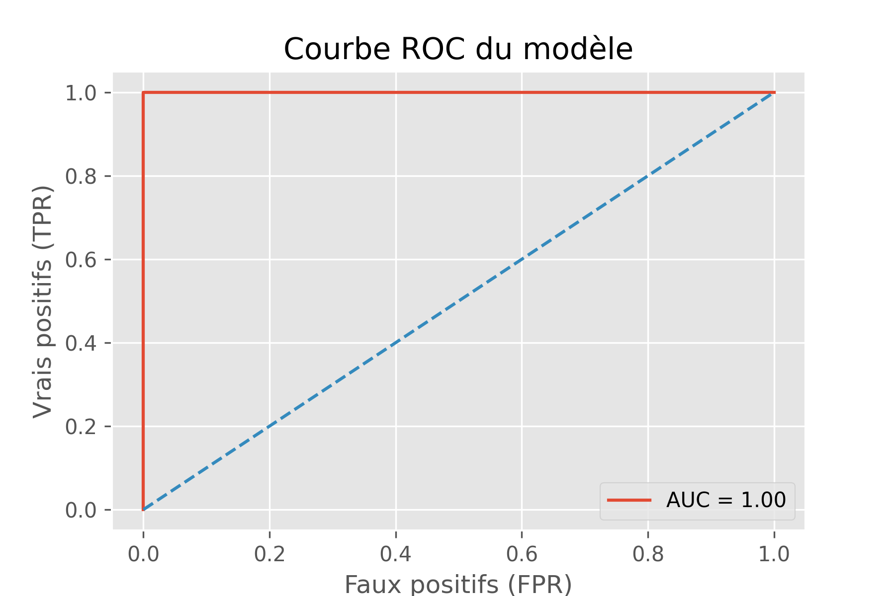
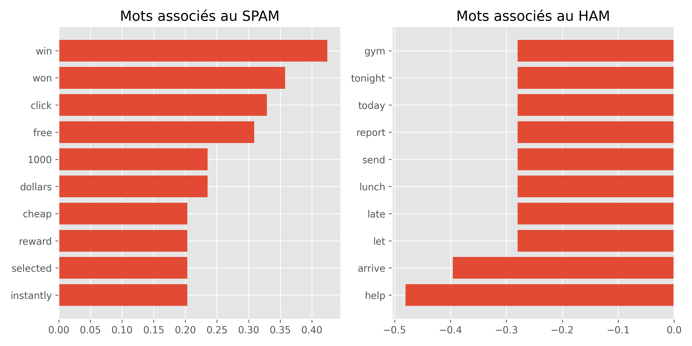

# 📧 Spam Detection & Text Analytics

A machine learning project for SMS spam detection using Natural Language Processing (NLP), TF-IDF vectorization, and Logistic Regression.

---

## 📌 Project Overview

This project analyzes SMS messages and classifies them as:

- 🟢 HAM (Legitimate Message)
- 🔴 SPAM (Unwanted / Fraudulent Message)

The workflow includes:

- Data Cleaning
- Exploratory Data Analysis (EDA)
- Feature Engineering
- Machine Learning Classification
- Model Evaluation
- Visualization of Results

---

## 🚀 Technologies Used

- Python
- Pandas
- NumPy
- Matplotlib
- Seaborn
- Scikit-Learn

---

## 📊 Exploratory Data Analysis

### Distribution of Messages

Shows the number of HAM and SPAM messages.



---

### Message Length Distribution

Comparison of message lengths.



---

### Boxplot Comparison

Visual comparison of HAM and SPAM message lengths.



---

## 🤖 Machine Learning Model

### Text Vectorization

TF-IDF (Term Frequency - Inverse Document Frequency)

### Classification Algorithm

Logistic Regression

---

## 📈 Model Evaluation

### Confusion Matrix



---

### ROC Curve



---

### Important Words

Words that contribute most to SPAM and HAM predictions.



---

## 🧪 Sample Predictions

Examples:

| Message | Prediction |
|----------|------------|
| Win a free iPhone now | SPAM |
| Hey bro are you coming tonight | HAM |
| URGENT you won 1000 dollars | SPAM |
| Can you send me the file please | HAM |

---

## 📂 Dataset

The dataset contains SMS messages labeled as:

- ham
- spam

Used for supervised text classification.

---

## ▶️ Installation

Clone the repository:

```bash
git clone https://github.com/amirbargougui/spam-detection-text-analytics.git
```

Install dependencies:

```bash
pip install -r requirements.txt
```

Run:

```bash
python spam_classifier.py
```

---

## 🎯 Learning Outcomes

- Data preprocessing with Pandas
- Text feature extraction using TF-IDF
- Binary classification with Logistic Regression
- Model evaluation using Accuracy, ROC Curve and Confusion Matrix
- Data visualization with Matplotlib and Seaborn

